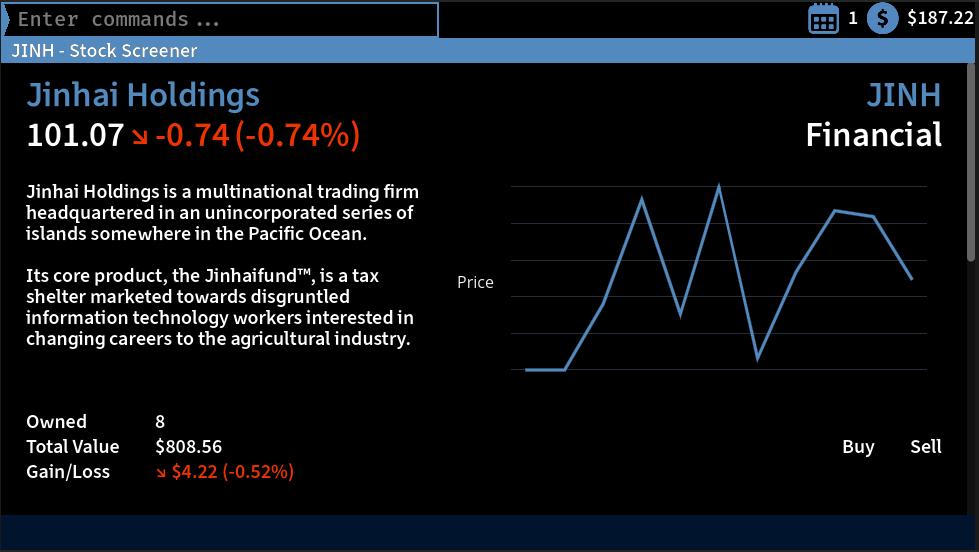

# Halfsunk Holdings
 

Halfsunk Holdings is a singleplayer management game built in the [Godot](https://godotengine.org/) game engine. You play as an investment manager of a struggling hedge fund. Make big money moves to get your firm out of debt, please your investors, and strike it rich!

Play the game in your browser [here](https://ozuyatamutsu.github.io/halfsunk-holdings/), or see the [Releases](https://github.com/OzuYatamutsu/halfsunk-holdings/releases) page for the latest desktop release of the game.

## Gameplay
(gameplay will be added when available)

## Building
Pull the repository and open `project.godot` in Godot 4.x or higher.

## License
This project is licensed under the [Blue Oak Model License 1.0](https://blueoakcouncil.org/license/1.0.0).

Bergoom and Fira Code are licensed under the [SIL Open Font License, Version 1.1](https://github.com/dchest/bergoom/blob/main/LICENSE.md).

Easy Charts is licensed under the [MIT license](https://github.com/fenix-hub/godot-engine.easy-charts/blob/main/LICENSE).

godot-marquee is licensed under the [MIT license](https://github.com/markeel/godot-marquee/blob/main/LICENSE).

Other assets:
- [Bird blue flying](https://opengameart.org/content/bird-blue-flying), by Enquest
- [Bossa Nova](https://opengameart.org/content/bossa-nova), by Joth
- [Along the Way](https://opengameart.org/content/along-the-way), by congusbongus
- Calendar icon by smashingstocks
- Money icon by Freepik

## Versions

### 0.2.4 (2026-03-31)

- Can trade stock (just the one)
- Can manage stock portfolio
- Stock market moves randomly
- Command system and page browser
- Start page and stock screener
- Sfx and music

### 0.1.0 (2025-05-10)

- Menus and UI, nothing playable yet
